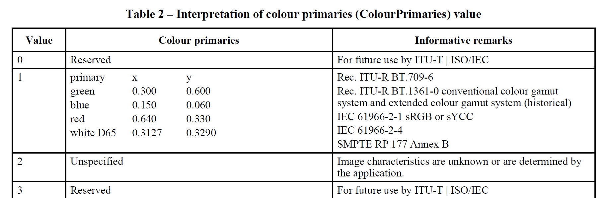
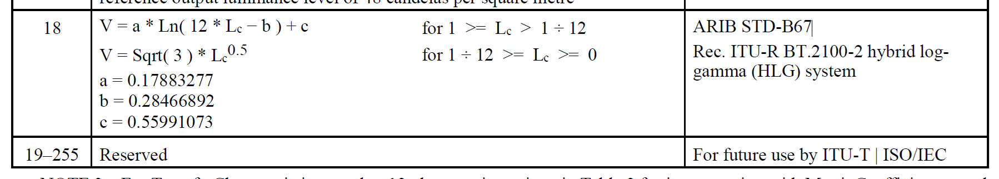

So, [PNG Third Edition](https://www.w3.org/TR/png-3/) adds
[Coding Independent Code Points](https://www.w3.org/TR/png-3/#cICP-chunk) (CICP)
for color space identification.
What is CICP,
why should you care,
should you be using it
and if so, how?

<!-- more -->

## Color spaces

(Hey, I already know what a color space is, [skip forward to CICP](#introducing-cicp))

Let us first define what we mean by a _color_.
It is an objective (measured) value,
describing the human visual perception
of some object that is emitting light
(or, for physical objects, is illuminated by some light
and reflecting some of that light to our eye).

This measurement consists of three numbers: X, Y and Z.
Two objects that have identical X, Y and Z values
will look exactly the same color
to a normal human observer [^CVD][^spectrum].

<div style="width: 5em; height: 5em; background-color: hotpink"></div>

That hot pink square, for example, has [X = 0.5453, Y = 0.3466
and Z = 0.4700](https://apps.colorjs.io/convert/?color=hotpink&precision=4)

Because working with three-dimensional data is hard,
it is common to convert XYZ values
into _chromaticity values_ (x,y) where:

x = X / (X + Y + Z)

y = Y / (X + Y + Z)

Two objects with the same chromaticity values
will look the same color,
but one may be brighter or darker than the other.

To reproduce a given color
on a particular screen,
we need to know the chromaticities
of the red, green and blue primaries
and also the exact color of the white
that results when those three are mixed together
in equal proportions.


<div style="text-align: center;">

_Chromaticity diagram
showing various RGB color spaces
and two white points_ [^license]

</div>

We also need to know the relationship
between the numbers we send to a screen
and the amount of light generated.
This is typically not a linear relationship.
For example, if a monitor takes values
between 0 and 255,
and we send a number in the middle (127),
we would typically only get 21% of the full amount of light,
not 50%.
This is called the _transfer function_ [^EOTF].


<p style="text-align: center;"><i>Four different transfer functions for various color spaces</i></p>

Taken together, the primary chromaticities
and the white point define the _gamut_ or
range of colors that a given screen can produce [^gamut].

If we also know the transfer function,
then for any color that is in gamut,
we can calculate the red, green and blue values
needed to display that color.
In other words, we have a defined [**color space**](https://drafts.csswg.org/css-color-4/#color-space).

So for example that same hot pink would need red = 0.9297 green = 0.4489 blue = 0.6964 on a Display P3 screen. On a screen with a different color space, the same color would need different numbers.

## Introducing CICP

The CICP specification allows labelling of *what* color space is used
for a given image.
It doesn't say *how to handle* that color space. [^label_vs_processing]
Because it is just saying _which_
of a small number of industry-standard color spaces
is being used,
the implementation is expected to handle them all.

### Video what?

CICP wasn't invented for PNG. It builds on
an International Telecommunication Union (ITU) specification
for broadcast and television
whose full title is, somewhat confusingly,
_“Coding-independent code points for video signal type identification”_.

This heritage explains some of the choices for what was included
(many old, historical, or obsolete video standards),
and what was left out (common color spaces for still images, like ProPhoto RGB).

But CICP isn't just for video anymore;
it has been adopted by still-image and animation formats
like [AVIF](https://github.com/AOMediaCodec/libavif/wiki/CICP) and
[JPEG-XL](https://www.loc.gov/preservation/digital/formats/fdd/fdd000536.shtml#factors). 
And now, PNG as well.

### Four (well, two) numbers

To save space and to encourage automated processing,
CICP encodes the color space using just four numbers,
each of which can be encoded in one byte.
The actual meaning of each one
can be found in the [ITU H.273 specification](https://www.itu.int/rec/T-REC-H.273).

Of those, two are vitaly important:
the **Color Primaries**,
which tell you the chromaticity
of the white, red, green and blue,
thus defining the color gamut;
and the **Transfer Characteristics**
or Electro-Optical Transfer Function (EOTF),
which allows interconverting between
the pixel values in the image
and the light intensities emitted by the display.

In theory these are independent, but not all combinations make sense.
Also, sometimes multiple color standards use the same primaries, or the same transfer function.

For example, a value of 1 for primaries is used 
by a bunch of standards
including ITU-R BT.709-6
(which is used for High-Definition TV). 
More relevant for the web, it is also used by IEC 61966-2-1
(which is sRGB, the basic default color space for the web ever since CSS 1).



To distinguish between these various options,
we also need to give the transfer function.
For sRGB, we want transfer function 13


while for HDTV, we need transfer function 1


Turning now to wide gamut images,
a primaries value of 11
is used by SMPTE RP 431-2,
otherwise known as DCI P3
and used for digital cinema reference projectors.
While a value of 12
is used by SMPTE EG 432-1,
which covers Color Processing for D-Cinema.
Notice that the red, green and blue chromaticities are identical.
The whites differ, DCI-P3 uses a weird, somewhat greenish white [^DCI-white]
while the other one, 
which is used for general wide-gamut digital video workflow,
uses the widespread D65 daylight white.


If we combine primaries 12 and transfer 13
(yes, the exact same one as sRGB uses)
we end up with [Display P3](https://www.color.org/chardata/rgb/DisplayP3.xalter)
which is the most common wide-gamut color space
for modern web content.

### The other two numbers

I did say earlier that two of the four numbers in CICP were _vitally important_
and you probably wondered what was up with the other two.

The fourth number specifies whether **Full Range or Narrow Range** is used.

Most digital image processing uses the full range of code values:
for 8-bit data,
black is at 0 and white at 255,
while for 16-bit data,
black is again at 0 and white at 65535.

In 10-bit narrow range, black starts at 64 (not 0)
and white is at 940 (not 1023);
in 16-bit narrow-range,
black starts at 4096 (not 0)
and white is at 60160  (not 65535).
This is called the "legal range".
The extra headroom and footroom outside that range (called the "extended range")
is used to capture momentary excursions outside the legal range,
such as overshoots (ringing) from image filtering [^EBU-103].
This was also used to slightly extend the dynamic range in some systems (super whites).

On SDI video systems, certain values are _reserved_
and used for things like
[synchronization packets](https://en.wikipedia.org/wiki/Serial_digital_interface#Synchronization_packets),
line counts and cyclic redundancy checksums.
For example, a 10-bit SDI system will reserve values 0 to 3
and 1020 to 1023 for synchronization packets and ancillary data [^SMPTE-RP-2077].

It is worth noting that these types of video systems rarely handle RGB data directly;
instead they use luminance and chrominance (Y'CbCr) data.
If that content gets converted to RGB to make a still image or short animated sequence,
there is the option to convert to Full Range RGB at the same time.

All of which is to say that narrow range RGB data is not so common in practice 
(it is also poorly supported in browsers at the current time).
Narrow range RGB PNG images do exist, 
but they are generated and processed in video workflows [^DVR2]
and don't often show up in the wild on the web.

Which brings us to the remaining (third) number, **Matrix coefficients**.

This gives the matrix to convert from Y'CbCr to RGB.
Since PNG only handles RGB data, the value of this in PNG images 
is _always_ zero, meaning "data is already RGB, nothing to do".

Why, then, did we bother storing it at all?

Two reasons – compatibility and extensibility.

To interoperate with other systems, 
which do handle formats other than RGB,
it is better to explicitly store the extra number even if the value is fixed.
It is only one byte, after all.

Also to allow future extension
(maybe a newer version of PNG will store other formats than RGB)
it is also better to store it explicitly in this version.

### High Dynamic Range

The color spaces used as examples so far in this post have all been
 _Standard Dynamic Range_ (SDR),
meaning that the media white (as in CSS `white` or `RGB #FFFFFF`) 
is also the brightest color that can be displayed.
Media white can be comfortably viewed, over the whole screen.

This limits the dynamic range to around 8 stops [^dynamic-range]
which is not enough for high quality images and video.

In _High Dynamic Range_ (HDR),
the same media white can of course be produced,
but also significantly _brighter_ colors
(and significantly _darker_ colors than the dark gray
which often represents `black` on SDR systems).
For example, an HDR reference monitor
might have a dynamic range of 14 stops [^HDR-range].

By far the most commonly used HDR primaries
(used by HDR streaming services
like, for example, Netflix, Prime, and Disney+ [^trademarks])
are defined in **ITU-R BT.2100** [^BT2100].
These give a significantly wider gamut than Display P3,
although content does not necessarily take advantage
of the full gamut [^p3-in-2020].

This is indicated in CICP with a primaries value of 9:


To define a color space we also need the transfer function,
and in fact threre are three in common use.

The first is **ITU-R BT.2020** [^BT2020],
an SDR space used for UltraHD (4k) television.

This uses transfer values 14 or 15
(depending on whether the content uses 10 bits or 12 bits per component)
which is a bit sneaky since the actual equations are the same;
CICP does not have a separate way to indicate significant bits
although PNG does [^sBIT]:


The second is **Perceptual Quantizer (PQ)**,
an HDR space used for color graded content such as movies.

In CICP, PQ is indicated with transfer value 16
(and note this covers bit depths from 10 to 16):


PQ was first defined by **SMPTE ST 2084**
and is now a part of **ITU-R BT.2100**.

The third is **Hybrid Log Gamma (HLG)**,
an HDR space used for live broadcast such as sports,
and also for iPhone video clips [^iPhone-HLG].

In CICP, HLG is indicated with transfer value 18:



HLG was first defined in **ARIB STD-B67**
and is now a part of **ITU-R BT.2100**.

Lastly, HDR content that doesn't need
(and isn't required to use) BT.2100
can specify P3 D65 with the PQ transfer function:
primaries 12, transfer 16.
This is used in, for example, Dolby Vision HDR.

### CICP compared to ICC profiles

In summary,
since ICC profiles are currently the main way to ensure accurate color
(at least, for still, SDR images)
here is a quick comparison.

|     CICP                              | ICC                   |
|                   :---:               |    :---:              |
| RGB, YCC, XYZ [^stupid_xyz]           | RGB, CMY, CMYK, Lab   |
| list of known spaces[^weird_obsolete] | any space [^measured] |
| small                                 | larger to very large (CMYK) [^detailed_sizes]|
| what it is                            | what to do with it    |

Since PNG is limited to RGB images, 
the fact that CICP doesn't support things like CMYK or Lab 
is not an issue.
However, it does mean that common but not representable RGB spaces
like Adobe 1998 RGB or ProPhoto RGB
cannot use CICP
and have to be identified with ICC profiles instead.

## `cICP` in PNG

### Wait why the little c

Chunks in PNG use four ASCII letters.
If the first letter is uppercase (for example [`IHDR` Image header](https://www.w3.org/TR/png-3/#11IHDR))
then that chunk is **critical**;
the image cannot be understood without it.
There are [only four critical chunks](https://www.w3.org/TR/png-3/#11Critical-chunks).

If the first letter is lowercase (for example [`cICP`](https://www.w3.org/TR/png-3/#cICP-chunk))
then that chunk is **ancillary**;
the image can be displayed without understanding this chunk.
Most chunks are ancillary.

For some ancillary chunks (like [`tIME`, the image last-modification time](https://www.w3.org/TR/png-3/#11tIME))
ignoring the chunk has no impact on image display at all;
for others, like `cICP`, ignoring it means the image is displayed with the wrong colors.

### Adds just 16 bytes

Compared to the [`iCCP` Embedded ICC profile](https://www.w3.org/TR/png-3/#11iCCP) chunk,
which adds 23 bytes **plus** the size of the compressed profile,
[`cICP`](https://www.w3.org/TR/png-3/#cICP-chunk) adds a total of 16 bytes to the image.

Checking on some [ICC profiles in PNG tests](https://github.com/svgeesus/PNG-ICC-tests)
I found the smallest _compressed_ profile
was 312 bytes, so it adds 335 bytes in total;
the largest was 8,825 bytes, so it adds 8,848 in total.

Naturally this makes more of a difference for tiny to small PNG images.

### Browser support

The [`cICP` section of the 
Implementation Report](https://w3c.github.io/png/Implementation_Report_3e/#cicp)
(a dated snapshot, needed for a W3C specification to become a standard)
lists support in various tools,
including browsers.

CICP in PNG is supported in Chrome (and thus, Edge); Firefox, Safari,
and two new, up-and coming browsers [^diversity],
[Servo](https://servo.org/) and [Ladybird](https://ladybird.org/)

To demonstrate, here is a sample PNG image [^revoy]
which uses `cICP` to label the color space,
which in this case is BT.2020.


Now, if your browser did not support `cICP` in PNG images,
that image would look the same as this, incorrect, washed-out one:


Sadly, if your browser is displaying on an old, sRGB-only screen [^how-can-I-tell]
the images will also look similar,
but that is the best your screen can do.
Luckily, most modern hardware can display most of the Display P3 gamut.

### What is in my PNG

By now you may well be wondering,
are the PNG images I am exporting
from my favorite program already using `cICP`?
Or something else?
Or nothing?

I recently extended an ancient command-line tool,
[pngcheck](https://github.com/pnggroup/pngcheck),
to support all the PNG Third Edition chunks
including `cICP`.

Without any arguments, 
it just tells you whether the PNG iage(s)
are valid or not (plus some summary information)

```bash
$ pngcheck lin-srgb-hlg-pq.png
OK: lin-srgb-hlg-pq.png (839x803, 32-bit RGB+alpha, non-interlaced, static, 97.6%).
```

With the `-v` option (v for verbose)
it also lists each of the chunks in the file
(this can get quite long, for larger images):

```bash
$ pngcheck -v lin-srgb-hlg-pq.png
File: lin-srgb-hlg-pq.png (64792 bytes)
  chunk IHDR at offset 0x0000c, length 13
    839 x 803 image, 32-bit RGB+alpha, non-interlaced
  chunk sBIT at offset 0x00025, length 4
    red = 8 = 0x08, green = 8 = 0x08, blue = 8 = 0x08, alpha = 8 = 0x08
  chunk pHYs at offset 0x00035, length 9: 5905x5905 pixels/meter (150 dpi)
  chunk tEXt at offset 0x0004a, length 56, keyword: Software
  chunk IDAT at offset 0x0008e, length 8192
    zlib: deflated, 32K window, default compression
  chunk IDAT at offset 0x0209a, length 8192
  chunk IDAT at offset 0x040a6, length 8192
  chunk IDAT at offset 0x060b2, length 8192
  chunk IDAT at offset 0x080be, length 8192
  chunk IDAT at offset 0x0a0ca, length 8192
  chunk IDAT at offset 0x0c0d6, length 8192
  chunk IDAT at offset 0x0e0e2, length 7202
  chunk IEND at offset 0x0fd10, length 0
No errors detected in lin-srgb-hlg-pq.png (13 chunks, 97.6% compression).
```

So, that one doesn't have any color information at all.
Browsers will treat is as sRGB.

Here is an example which includes an ICC profile (the `iCCP` chunk):

```bash
$  pngcheck -v macbeth-v2-ProPhoto.png
File: macbeth-v2-ProPhoto.png (2530 bytes)
  chunk IHDR at offset 0x0000c, length 13
    670 x 450 image, 24-bit RGB, non-interlaced
  chunk iCCP at offset 0x00025, length 666
    profile name = LittleCMS ICC profile, compression method = 0 (deflate)
    compressed profile = 643 bytes
  chunk IDAT at offset 0x002cb, length 1795
    zlib: deflated, 32K window, maximum compression
  chunk IEND at offset 0x009da, length 0
No errors detected in macbeth-v2-ProPhoto.png (4 chunks, 99.7% compression).
```

And now, one with the `cICP` chunk.
The cryptic H.273 codes are expanded to human-readable color space information;
this one uses BT.2100 primaries and the PQ transfer curve:

```bash
$ pngcheck -v test_pattern-PQ-cICP-cLLI.png
File: test_pattern-PQ-cICP-cLLI.png (9796 bytes)
  chunk IHDR at offset 0x0000c, length 13
    1024 x 1024 image, 48-bit RGB, non-interlaced
  chunk cICP at offset 0x00025, length 4
   Rec. ITU-R BT.2100-2 perceptual quantization (PQ) system
    White x = 0.3127 y = 0.329,  Red x = 0.708 y = 0.292
    Green x = 0.17 y = 0.797,  Blue x = 0.131 y = 0.046
    Full range
  chunk cLLI at offset 0x00035, length 8
    Maximum content light level = 10000 cd/m^2
    Maximum frame average light level unknown
  chunk IDAT at offset 0x00049, length 8192
    zlib: deflated, 32K window, default compression
  chunk IDAT at offset 0x02055, length 1499
  chunk IEND at offset 0x0263c, length 0
No errors detected in test_pattern-PQ-cICP-cLLI.png (6 chunks, 99.9% compression).
```


### The `png_cicp_editor` utility

Some programs will export a PNG,
but expect you to pass along the color space info yourself
to whatever program is next in your pipeline.
Clearly, that won't work on the web;
browsers will [assume the untagged image is in sRGB](https://drafts.csswg.org/css-color-4/#untagged).

So there is a need to take a given PNG,
where you already know the color space,
and add `cICP` without otherwise altering the image.

[Chris Blume](https://github.com/ProgramMax),
who is the chair of the W3C PNG Working Group,
wrote [a nice little command-line utility](https://github.com/ProgramMax/png_cicp_editor)
to do that one specific task.
It is called `png_cicp_editor`.
Here it is being used to label a PNG image as display P3:

```bash
png_cicp_editor add --preset display-p3 test.png
```

Notice that your image is modified in-place.
Notice too that the actual image data is _not changed_ in any way
(it does **not** do color space conversion),
this utility simply inserts the missing color space labelling
that should have been there anyway.

Here is another example, marking an HDR image
as being in the BT.2100 color space with PQ transfer function:

```bash
png_cicp_editor add --preset bt.2100-pq test2.png
```

The available presets [^preset_list] cover the most common
color spaces which will be encountered in practice.

But to avoid clutter, they don't cover all possible options.
Suppose you have a PNG image converted from some old video format,
which CICP does in fact support.
Then you can provide your four numbers directly
(you will need to look them up in the
[ITU H.273 specification](https://www.itu.int/rec/T-REC-H.273),
which is freely available).

For example, to label an RGB image decoded from an old [SECAM video](https://en.wikipedia.org/wiki/SECAM):

```bash
png_cicp_editor add --color_primaries 5 --transfer_function 4 --matrix_coefficients 0 --video_full_range_flag 1 secam-test.png
```


## Geeknotes

[^CVD]: Normal in the sense that they do not have 
what is commonly, but inaccurately, called _color blindness_.
Better terms are _atypical color vision_
or _color vision deficiency_ (CVD)
because those people are usually not **unable** to tell the difference
between, say, a red and a green;
rather their ability to tell them apart is reduced. Because the genes controlling this are on the X chromosome,
people who have only one X chromosome (XY) are 
[much more likely](https://www.visioncenter.org/resources/color-blind-statistics/)
to have CVD (8%).
People with two (XX) are much less likely to have both of them affected;
around 0.5%.

[^spectrum]: For objects that emit light,
it doesn't matter what their exact emission spectrum is
(how much light they produce at each wavelength).
For objects that reflect light,
it also doesn't matter, _**if** the light source that is illuminating them is constant_.
Otherwise, they may or may not match. This is called _metamerism_ [^corresponding].

[^corresponding]: No, I am not going to get into corresponding colors and chromatic adaptation.
At least, not in this particular blog article.

[^license]: [WikiMedia Commons image](https://en.wikipedia.org/wiki/File:CIE1931xy_gamut_comparison_of_sRGB_P3_Rec2020.svg) by 
Andrew Somers, used under a CC-BY-SA 4.0 license

[^EOTF]: In full, the **Electro-Optical Transfer Function (EOTF**). Just to be extra spicy, some standards instead define the **Opto-Electrical Transfer Function** and let you do the math.

[^gamut]: Want a deep dive on color gamuts?
You are in luck, I [have a whole blog post about that](https://svgees.us/blog/whatGamuts.html).

[^label_vs_processing]: ICC profiles, on the other hand,
define how to convert image data to and from XYZ,
but don't tell you what the data actually is.

[^DCI-white]: This is actually the color produced by the [xenon lamp](https://www.lamptolaser.com/fact5.html) inside the reference projector.

[^EBU-103]: For further details see EBU-R-103 (2020) [_Video Signal Tolerance 
in Digital Television Systems_](https://tech.ebu.ch/docs/r/r103.pdf).

[^SMPTE-RP-2077]: For further details see Society of Motion Picture 
and Television Engineers (2013) SMPTE-RP-177 [_Full-Range Image Mapping_](https://standards.globalspec.com/std/1284890/smpte-rp-177).

[^DVR2]: For example, the video post-production software suite 
[DaVinci Resolve 20](https://www.blackmagicdesign.com/products/davinciresolve) 
fully supports both Full-Range and Narrow-Range PNG images on import and export.

[^dynamic-range]: Dynamic range is the
[difference in luminance](https://drafts.csswg.org/css-color-hdr-1/#defining-dynamic-range)
between the lightest and the darkest colors.
Dynamic range is measured in photographic _stops_.
One stop is a doubling of luminance.

    If you want to play with this, the equation is very simple:

    ```js
    function DynamicRange (high, low) {
    return Math.log2(high) - Math.log2(low);
    } 
    ```

    For example, in sRGB, under standard viewing conditions,
    white is defined to have a luminance of 80 cd/m²
    while black is defined to have a luminance of 0.2 cd/m².
    Thus, the dynamic range is 8.6 stops.

[^HDR-range]: For example, on an HDR reference mastering display,
the small-area peak white might have a luminance of 1000 cd/m²
while the deepest black has a luminance of 0.05 cd/m².
Thus, the dynamic range is 14.3 stops.

[^trademarks]: All trademarks mentioned are the property of their respective owners.

[^BT2100]: ITU-R BT.2100-2 (2018) [_Image parameter values
for high dynamic range television
for use in production and international programme exchange_](https://www.itu.int/dms_pubrec/itu-r/rec/bt/R-REC-BT.2100-2-201807-I!!PDF-E.pdf).

[^p3-in-2020]: Common practice is to
create and color grade HDR content
on an HDR display which uses P3 primaries and D65 white point,
but then (for example for hardware or software compatibility)
to convert the image data to BT.2100 [^MDCV].

[^MDCV]: It would be pretty useful,
for good color gamut mapping,
to know the actual range of colors used for a given image, animation or video.

    PNG Third Edition has a special chunk,
    [`mDCV` Mastering Display Color Volume](https://www.w3.org/TR/png-3/#mDCV-chunk)
    for that very purpose.

[^BT2020]: ITU-R BT.2020-2 (2015) [_Parameter values for
ultra-high definition television systems
for production and international programme exchange_]([)](http://www.itu.int/rec/R-REC-BT.2020/en).

[^sBIT]: PNG uses the [`sBIT` Significant bits](https://www.w3.org/TR/png-3/#11sBIT) chunk for this purpose.

[^iPhone-HLG]: See the Apple support article [Edit HDR video recorded on an iPhone or iPad](https://support.apple.com/en-us/102241). The color space is (incorrectly) called "Wide Gamut HDR - Rec. 2020 HLG" in that article.

[^stupid_xyz]: CIE XYZ _is_ available, but with a stupid equi-energy white point: x=0.3333 y=0.3333. CICP can't be used to label useful spaces like xyz-d65 or xyz-d50.

[^weird_obsolete]: Sadly, some of those code values are taken up by
obsolete or historical video systems that nobody uses anymore.
And most values are reserved for future standardization.

[^measured]: ICC profiles can describe how to process any color space that has been measured.
In the case of RGB profiles, that means measuring the color and white primaries
and the transfer curve;
for CMY and CMYK profiles,
it entails measuring several hundred color patches
to build an inverse lookup table.

[^detailed_sizes]: The `cICP` chunk (including chunk name, length and checksum)
adds 16 bytes,
much smaller than even a minimal ICC profile.
`iCCP` holds compressed profiles but even so
the size can be significant for smaller files.

[^diversity]: Browser engine diversity is a good thing for the web in general.
Not only does it give users more choice,
but it makes the web more robust
and more resistant to being controlled by, and aimed towards, a single browser engine.
Chris Coyier [explains it well in a CSS Tricks article](https://css-tricks.com/browser-engine-diversity/)
as does Brian Kardell discussing [Ecosystem Health](https://bkardell.com/blog/EcosystemHealth.html).

[^revoy]: The original (and higher resolution) image is entitled
[Happy 25th anniversary, Krita!](https://www.davidrevoy.com/article1031/happy-25th-anniversary-krita)
by [David Revoy](https://www.davidrevoy.com/)
and is used here with explicit permission
(including for the version with the wrong colors!)
under a [CC-BY-SA 4.0 International](https://creativecommons.org/licenses/by-sa/4.0/) license.

    Both versions used here are modified from the original:

    - the image was resampled to a lower resolutions
    - the image was converted to BT.2020 color space
    - the image was exported as PNG, with no embedded ICC profile and without converting to sRGB

    For the correct image, a `cICP` chunk was added as described in this blog post

    For the incorrect image, it was not.

[^how-can-I-tell]: Test pages [like this one](https://www.wide-gamut.com/test)
will let you see whether you are using a wide gamut monitor.

[^preset_list]: Here are the names of all the presets (as of March 2025)
together with the specifications that define each color space
and some places where they are commonly used:

    | Preset         | Specification                                                            | Used for             |
    |----------------|--------------------------------------------------------------------------|----------------------|
    | bt.601-pal     | Rec. ITU-R BT.601 625-line 50 Hz (PAL)                                   | old video framegrabs |
    | bt.601-ntsc    | Rec. ITU-R BT.601 525-line 60 Hz (NTSC)                                  | old video framegrabs |
    | bt.709         | Rec. ITU-R BT.709-6                                                      | HDTV (1080p)         |
    | srgb-linear    | linear-light sRGB                                                        | video games, GPU     |
    | srgb           | IEC 61966-2-1 sRGB                                                       | web default          |
    | bt.2020-10-bit | Rec. ITU-R BT.2020-2 (10-bit system)                                     | 4k streaming         |
    | bt.2020-12-bit | Rec. ITU-R BT.2020-2 (12-bit system)                                     | 4k streaming         |
    | bt.2100-pq     | Rec. ITU-R BT.2100-2 perceptual quantization (PQ) system                 | HDR streaming        |
    | bt.2100-hlg    | Rec. ITU-R BT.2100-2 hybrid log-gamma (HLG) system                       | iPhone video, images |
    | dci-p3         | SMPTE RP 431-2 with SMPTE ST 428-1 D-Cinema Distribution Master (DCI-P3) | digital cinema       |
    | display-p3     | Display P3                                                               | modern WCG web       |
    | p3-d65-pq      | P3-D65 PQ                                                                | Dolby Vision HDR     |

    For Dolby Vision mastering, see [Dolby Vision Content Creation Best Practices Guide](https://professionalsupport.dolby.com/s/article/Dolby-Vision-Content-Creation-Best-Practices-Guide?language=en_US)

<!-- Use the files in the ICC test page as input.
profile size, PNG size (compressed, plus chunk overhead)

ICCv2 sRGB (rgswap)  chunk iCCP at offset 0x00025, length 335
    profile name = LittleCMS ICC profile, compression method = 0 (deflate)
    compressed profile = 312 bytes
 uncompressed 1156

v2-CIE-Lstar chunk iCCP at offset 0x00025, length 8848
    profile name = LittleCMS ICC profile, compression method = 0 (deflate)
    compressed profile = 8825 bytes
 uncompressed 9376

v2-ProPhoto  chunk iCCP at offset 0x00025, length 666
    profile name = LittleCMS ICC profile, compression method = 0 (deflate)
    compressed profile = 643 bytes
 uncompressed 1260

v40-DisplayP3 chunk iCCP at offset 0x00025, length 376
    profile name = LittleCMS ICC profile, compression method = 0 (deflate)
    compressed profile = 353 bytes
 uncompressed 536

v4-CIE-Lstar  chunk iCCP at offset 0x00025, length 624
    profile name = LittleCMS ICC profile, compression method = 0 (deflate)
    compressed profile = 601 bytes
 uncompressed 1144

v4-ProPhoto chunk iCCP at offset 0x00025, length 616
    profile name = LittleCMS ICC profile, compression method = 0 (deflate)
    compressed profile = 593 bytes
 uncompressed 1156 -->
