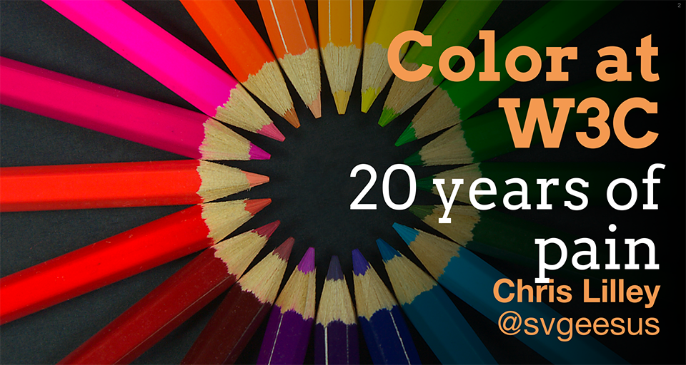

CSS Color 4 is now widely implemented. But it has been a long and bumpy ride!
Why did it take so long, and why did it finally succeed?

<!-- more -->

## 20 years of pain

In October 2018 I gave a talk entitled _"Color at W3C"_. The overall tone can be judged from the subtitle, which was **"20 years of pain"**. It was a historical recounting of many attempts, over the years, to get color on the Web to catch up with color in print-oriented graphic arts, where color management was ubiquitous. ([Slides](https://www.w3.org/Talks/2017/css4-color-talk/20years.html#intro), for anyone interested).



The talk ended up with a summary of the earliest drafts of CSS Color 4, which was starting to get CSS Working Group consensus and the earliest glimmerings of developer and implementer interest.

Despite the depressive subtitle, I was told that I actually delivered a fairly amusing and informative keynote; but truth be told, I was still not sure that we would make it this time.

## So what had changed

One difference from earlier attempts was that I provided [sample JavaScript code](https://drafts.csswg.org/css-color-4/#color-conversion-code) to implement colorspace conversions, which are actually relatively straightforward, to encourage potential implementers who might assume that this was all _fearsomely complex_.

```js
function lin_P3_to_XYZ(rgb) {
	// convert an array of linear-light display-p3 values to CIE XYZ
	// using  D65 (no chromatic adaptation)
	var M = [
		[ 608311 / 1250200, 189793 / 714400,  198249 / 1000160 ],
		[  35783 /  156275, 247089 / 357200,  198249 / 2500400 ],
		[      0 /       1,  32229 / 714400, 5220557 / 5000800 ],
	];

	return multiplyMatrices(M, rgb);
}
```
Another difference was that Wide Color Gamut screens had, around 2017, finally broken out of the super expensive, only-for-pro-photographers niche and P3 screens were being widely deployed in laptops, tablets and phones. Even watches!

While that sample code was easy to read and understand, it was also a bunch of small, low-level functions so actually using it involved making many nested function calls in precisely the right order.


Together with [Lea Verou](https://lea.verou.me/) we made an object-oriented library with good defaults, [Color.js](https://colorjs.io/), so colorspace conversion became trivial. Compare (yes, I had to look this up):

```js
    // Convert a display-p3 color RGB, to D50 CIE Lab
    let lab = XYZ_to_Lab(D65_to_D50(lin_P3_to_XYZ(lin_P3(RGB))));
```

with

```js
    // Convert a display-p3 color RGB, to D50 CIE Lab
    let lab = RGB.to("lab");
```

As a bonus, Color.js helped myself and others to make spec examples and web platform tests, and functioned as a sanity check for early browser implementations.

Color.js has continued to evolve and expand, and has cross-pollinated with implementations in other languages like Rust or Python (we raise issues on each other's repos).

## Safari: the first in-browser implementation

Talking of implementation-led spec development, CSS Color 4 started to show up in Safari Technology Previews, starting with [release 120 in February 2021](https://developer.apple.com/documentation/safari-technology-preview-release-notes/stp-release-120). Sam Weinig  did a stellar job tracking a changing specification, giving detailed feedback, and creating tests.

By March 2022 the new CSS Color 4 colorspaces *plus* the  [`color-mix()` function from CSS Color 5](https://drafts.csswg.org/css-color-5/#color-mix) were part of [Interop 2022](https://web.dev/interop-2022/#color-spaces-and-css-color-functions) - a cross-browser push for reliable and fully interoperable implementation. Which means Chrome and Firefox had started to implement, too.

Follow the link to see that awesome wall of green (passing tests) in all major browsers!

- [current Interop 2022 results for color functions and formats](https://wpt.fyi/results/css/css-color?product=chrome&product=firefox&product=safari&aligned=&view=interop&q=label%3Ainterop-2022-color&label=master&label=experimental).

So now, old/dead browsers and some minor browsers aside, this stuff is implemented everywhere! Here is the [CanIUse](https://caniuse.com/css-color-function). But wait! (you say, reasonably) I need fallback for those old dead zombie browsers. Of course you do, and `@supports` gives you some of that. But better: [Lightning CSS](https://lightningcss.dev/) gives you a fast, Rust-based server-side rendering

- [`color()` function transpiling](https://lightningcss.dev/transpilation.html#color-function)
- [`lab()` function transpiling](https://lightningcss.dev/transpilation.html#lab-colors)
- [`color-mix()` function transpiling](https://lightningcss.dev/transpilation.html#color-mix)

Also, [sass is working on it](https://github.com/sass/sass/issues/2831), too.

## What is missing?

Great so what is missing? **Understanding**. Not "what syntax can I use" but "what should I do, and why; what are the trade-offs?"

As an example: _wide gamut color_. What is a gamut, why should I care?

I [wrote a thing to explain that](https://svgees.us/blog/whatGamuts.html), and it is positively bristling with footnotes (yay!).

Sadly, I am seeing blog posts and documentation which _entirely miss the point_ and boil down to "here are 12 more syntaxes to specify a color".

Yeah but _why_ would you use one over the other? What does it get you? What are the benefits and drawbacks?

**I think this is the current barrier to adoption.**

I do plan to write more blog posts on this stuff (a couple are in progress) but they take a lot of time and effort to get right.


I'm also giving a talk about this at [Fronteers conference](https://fronteersconf.org/) Sept 21-22 2023 in Utrecht, NL so if a European CSS/Frontend conference sounds interesting, you could learn about it there!
