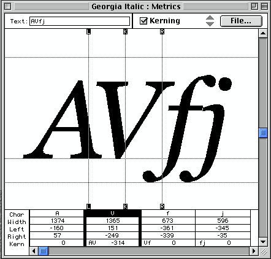
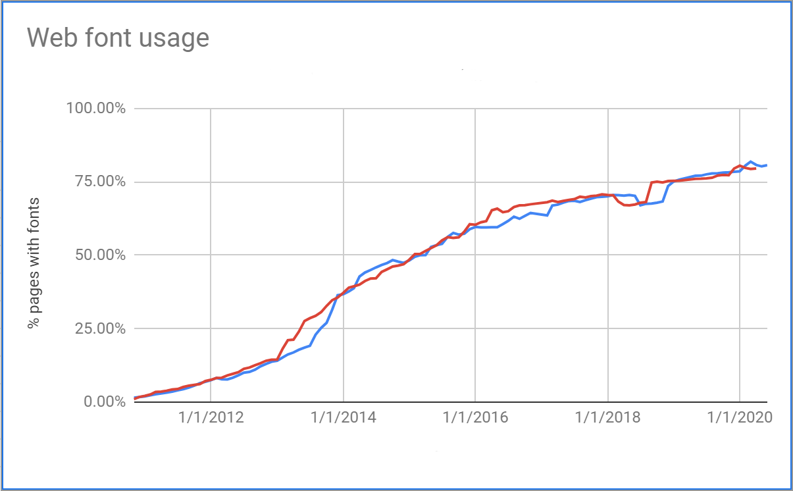
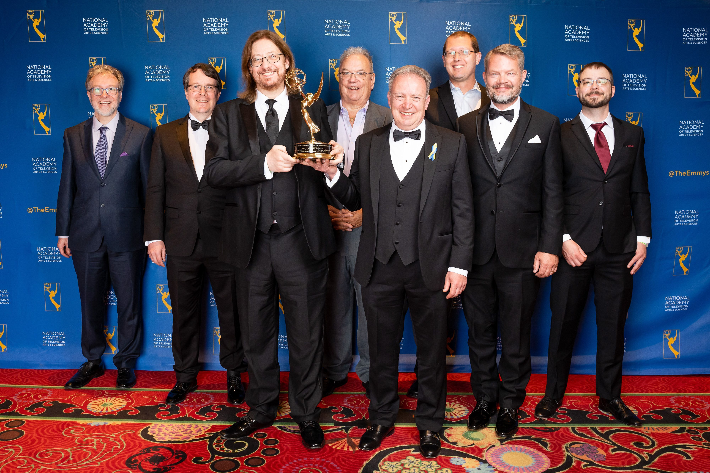
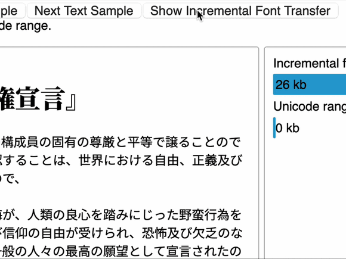

 27 July 2026 was the 16th anniversary of the [first public release of Web Open Font Format (WOFF)](https://www.w3.org/news/2010/first-draft-of-woff-file-format-10-published/), in 2010.

 Let me tell you how that happened, why it mattered, what became possible after that, and the projected future for WebFonts.

<!-- more -->

<em>Originally [published](https://www.w3.org/blog/2026/woff-1-0-a-milestone-on-w3cs-journey-of-fonts-on-the-web/?ref=frontenddogma.com) 
on the W3C blog, 28 July 2026. 
Also available
in Chinese and Japanese:</em> [中文（简体）](https://www.w3.org/zh-hans/blog/2026/woff-1-0-a-milestone-on-w3cs-journey-of-fonts-on-the-web/) and
[日本語](https://www.w3.org/ja/blog/2026/woff-1-0-a-milestone-on-w3cs-journey-of-fonts-on-the-web/)

## The Early Web

The invention of the World Wide Web has often been compared, in its world-changing impact on society, to the invention of the printing press in Europe. The pieces of moveable typeface used by Gutenberg helped to lead to a revolution in the sharing of information then, and Web Fonts have changed the way we now see and read text on the web, how we communicate; and they have literally changed the typographic face of the web.

High level thinking about fonts on the web had started soon after the founding of the World Wide Web Consortium (W3C) in 1994. In 1996 I wrote a [Rationale for Fonts on the Web](https://www.w3.org/TR/2022/NOTE-font-rationale-20220414/) and in 1997, the W3C Fonts Working Group released the [first public draft of Web Fonts](https://www.w3.org/TR/WD-font-970721) to provide “greater typographic richness for HTML pages” and improve “the internationalization of the Web”.  This standardized the means to link to a font (`@font-face`) which would be used on a web page without installation. But it did not mandate a font format, and licensing issues were not addressed.

<figure>

<figcaption>Blast from the past: Kerning example from the 1997 Web Fonts Working Draft</figcaption>
</figure>

## If we build it, will they come?

The CSS WG [adopted `@font-face` into CSS2](https://www.w3.org/TR/2008/REC-CSS2-20080411/fonts.html#font-descriptions) in 1998. But for over ten years, Web Fonts were barely used. Fierce technical discussions centered around licensing, encryption, “root strings” to tie a font to a specific website, font obfuscation and even full-fledged Digital Rights Management (DRM), which seemed to some to be needed to protect against widespread piracy. Meanwhile browser vendors were wary of their potential legal liability simply downloading a font and rendering a website with it.

W3C pulled together the hitherto disparate browser engineer and typographer communities into a common discussion forum, and over time the needs of each became clearer. In July 2009 Jonathan Kew, from Mozilla, [proposed the ZOT format](https://lists.w3.org/Archives/Public/www-font/2009JulSep/0018.html) which was simple to implement and used an already-deployed compression method (Zlib) to make the font smaller. Notably, there was no “root string” and no encryption.

That same month, typographers Tal Leming and Erik van Blokland proposed [a different format, `.webfont`](https://lists.w3.org/Archives/Public/www-font/2009JulSep/0361.html) which did still list the domains allowed to use the font but also contained links to the license and the font foundry so that, using the well established “view source” method, web developers could find out where a particular font came from and perhaps license it themselves. Again there was no encryption or obfuscation; just some basic informative links. Another well-known typographer, [John Hudson, declared](https://lists.w3.org/Archives/Public/www-font/2009JulSep/0580.html) that `.webfont` was an acceptable way forward for the type community.

By August, the inventors of the two formats [announced](https://lists.w3.org/Archives/Public/www-font/2009JulSep/1238.html) that they were working together and the formats had been merged into a new format, WebOTF (later renamed WOFF, for Web Open Font Format).

## WOFF at W3C

Responding to this emerging consensus on a way forward, in March 2010 W3C chartered a Working Group (chaired by Vladimir Levantovsky, then of Monotype) to develop WOFF 1.0. Crucially, this would be an entirely DRM-free technology. Many of the people who had contributed to the earlier discussions joined the Working Group, helped with early implementations, wrote software to produce the new format, and helped develop detailed test suites which are the bedrock of interoperability. In many cases, this was their first experience with Web standards.

On 27 July 2010 the [First Public Working Draft of WOFF 1.0](https://www.w3.org/TR/2010/WD-WOFF-20100727/) was published.

WOFF 1.0 was, therefore, the culmination of renewed conversations between the typography community and browser developers, a carefully judged set of "good enough" compromises, and by early 2011, as soon as it was implemented, WebFonts started to take off.

# Success At Last

<figure>

<figcaption>Growth in global WebFonts usage from near-zero in 2011 to 80% in 2020 <a href="https://www.w3.org/TR/PFE-evaluation/#ref-Sheeter-BigQuery">Sheeter BigQuery</a>, from the Progressive Font Enrichment Evaluation Report 2020</figcaption>
</figure>

The rapid success of WOFF 1.0 prompted a desire for improvements in areas such as compression efficiency; smaller fonts load and render faster. In March 2012 Raph Levien [proposed](https://lists.w3.org/Archives/Public/www-font/2012JanMar/0002.html) a two-stage approach using a font-specific pre-processing technology followed by better entropy compression.

The Working Group started to develop this improved version, selecting [MicroType Express](https://www.w3.org/submissions/MTX/) (contributed by Monotype) as the first stage, followed by an improved entropy compression scheme, ([Brotli](https://datatracker.ietf.org/doc/html/rfc7932), developed by a team led by Jyrki Alakuijala and Zoltán Szabadka at Google). Both technologies came with a worldwide, royalty-free license for anyone to use and implement; a W3C innovation that is crucial to widespread adoption.

In May 2014 the [First Public Working Draft of WOFF 2.0](https://www.w3.org/TR/2014/WD-WOFF2-20140508/) was published. Compared to WOFF 1.0, it gave up to 40% smaller file sizes. There was a smooth transition; both formats continued in use, with the more efficient format gradually becoming more prominent.

<blockquote>
<cite>The <a href="https://almanac.httparchive.org/en/2025/fonts#file-formats-and-optimization">2025 HTTP Archive Web Almanac Report noted</a>:</cite>

“WOFF2 (Web Open Font Format 2) offers superior compression, resulting in smaller file sizes for faster transfer, and it’s been supported by all major browsers for years now. In 2025, WOFF2 accounts for about 65% of font file requests on both desktop and mobile pages. [...] This consolidation around WOFF2 is a positive trend for performance, as the better compression leads to faster font loads and less bandwidth usage.”
</blockquote>

WOFF 1.0 and 2.0 were not restricted to the Web. Many TV and broadcast standards also mandated WOFF, enabling more visually appealing program guides and content for streaming TV networks.

Fifteen years after the launch of the Web Fonts Working Group, in April 2022, Vladimir Levantovsky, Raph Levien, Rod Sheeter, David Kuettel, Jyrki Alakuijala, Garret Rieger  and I accepted an <a href="https://www.w3.org/news/2022/w3c-to-receive-emmy-award-for-standardizing-font-technology/">Emmy award</a> for work on standardizing font technology for custom downloadable fonts and typography for web and TV devices.

<figure>

<figcaption>Raph Levien, Google; Jyrki Alakuijala, Google; Chris Lilley, W3C; Alan Bird, W3C Vladimir Levantovsky, W3C Invited Expert; Rod Sheeter, Google; David Kuettel; Garret Rieger, Google accepting an Emmy Award in 2022</figcaption>
</figure>

<cite>The <a href="https://almanac.httparchive.org/en/2025/fonts#introduction">HTTP archive 2025 Web almanac</a> states:</cite>

<blockquote>
“In 2025, web fonts were found on roughly 88% of websites, up slightly from about 87% in 2024. … Today, the question is less about whether a website uses web fonts, but rather which specific typefaces it displays and whether they use font features to display their full expressive potential.”
</blockquote>

WOFF (1.0) was important to establish WebFonts as an implementable concept. <a href="https://www.w3.org/TR/WOFF2/">WOFF 2</a> has since then replaced it, reaching the final status of W3C Recommendation in August 2024, as the journey to improve web typography continues.

## Building the Future

But progress never stops. When in October 2020 the Web Fonts Working Group published the [Progressive Font Enrichment: Evaluation Report](https://www.w3.org/TR/PFE-evaluation/) the group’s conclusions were that enabling WebFonts to be used where slow networks, very large fonts, or complex subsetting requirements currently preclude their use would be key to make WebFonts truly successful, given that its distribution is still uneven.

We expect that in the near future WOFF 2 will in turn be replaced by a better alternative. [Incremental Font Transfer](https://w3c.github.io/IFT/Overview.html), the current focus of the Web Fonts Working Group, is a technology that improves the latency of Web Fonts (including to address [areas without WebFont usage[(https://www.w3.org/TR/PFE-evaluation/#fail-large)])  by enabling partial and incremental download of some bytes of a font without damaging the layout (kerning, ligatures). In other words, Incremental Font Transfer can efficiently support fine grained increments to pages that use the Latin script, while also fully supporting complex scripts like Indic or Arabic, and for the first time providing usable webfonts for languages like Chinese, Japanese, and Korean that have many thousands of characters. 

<figure>

<figcaption>IFT demo example with Japanese text</figcaption>
</figure>

A working [IFT demo](https://garretrieger.github.io/ift-demo/) is available, and also an [IFT encoder](https://github.com/w3c/ift-encoder) is ready for testing.